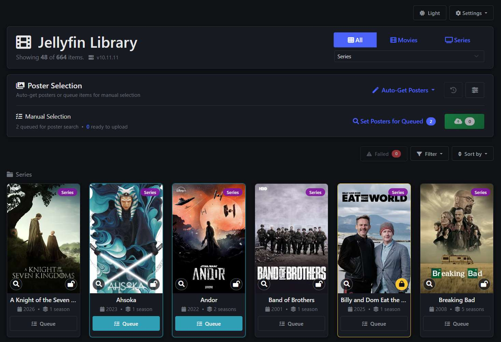
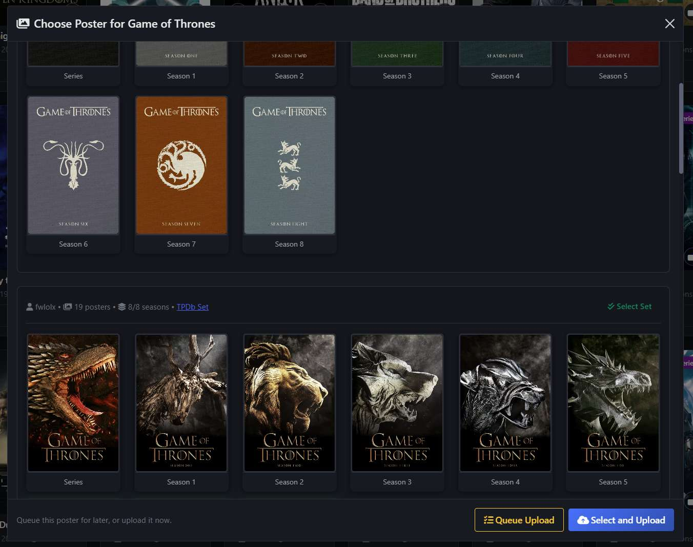

# Jellyfin Poster Manager

A modern web application for automatically finding and uploading high-quality posters to your Jellyfin media server from ThePosterDB.


## 📷 **Screenshots**




## 🎬 Features

### 🔍 **Smart Poster Discovery**
- Automatically searches ThePosterDB for high-quality movie and TV series posters
- Uses Jellyfin and TMDB metadata to improve title, year, movie, and series matching
- Groups TPDb poster sets and shows set metadata such as uploader and poster count
- Supports movie, series, and season poster discovery

### 🚀 **Batch Operations**
- **Auto-Get Posters**: Automatically find and upload posters for multiple items
- Run batches for all items, queued items, items without posters, movies only, or series only
- Filter batches by Jellyfin library and skip items already processed in previous runs
- Optionally include season posters and choose whether to replace existing season posters
- Cancellable background jobs with live progress, status counts, ETA, and latest-results access
- Failed and processed item history for retries, filtering, and cleanup

### 🎨 **Manual Selection**
- Browse multiple poster options for each item
- High-quality preview images
- Queue items for guided manual poster selection
- Select posters for immediate upload or queue selections for bulk upload
- Browse series seasons and matching TPDb poster sets when available

### 🛡️ **Protected Items**
- Mark individual Jellyfin items as protected so Auto-Get will skip them
- Filter the grid by processed, failed, queued, or protected status
- Clear processed history globally or for the currently visible items

### 📱 **Modern Interface**
- Responsive Bootstrap 5 design
- Works on desktop, tablet, and mobile devices
- Library, type, status, and sort controls
- Sort by library, name, year, or recently added
- Inline toasts, confirmation dialogs, status badges, and poster previews

### 🔧 **Advanced Features**
- Automatic image format conversion (WebP/AVIF → JPEG)
- Smart error handling and retry logic
- Structured processed, failed, and protected item storage
- Comprehensive logging, colored console output, and TPDb challenge debugging

## 📋 Requirements

- **Python 3.8+**
- **Jellyfin Server** (any recent version)
- **ThePosterDB Credentials** (free registration required)
- **Chrome / Chromium** for Selenium-based TPDb browsing
- **Network access** to both Jellyfin server and ThePosterDB

## 🚀 Quick Start

### 1. Clone the Repository
```bash
git clone https://github.com/TheCommishDeuce/TPDB_JellyfinPosterManager
```
### 2. Install Dependencies
```bash
pip install -r requirements.txt
```

### 3. Configuration
Rename `config_example.py` to `config.py` in the project root and update it with your settings, see example configuration below:

```env
# Jellyfin Configuration
JELLYFIN_URL = "https://jellyfin.your.tld"
JELLYFIN_API_KEY = "abc123def456ghi789"

# TPDb Configuration
TPDB_EMAIL = "user@your.tld"
TPDB_PASSWORD = "supersecretpassword123"

# TMDB Configuration
TMDB_API_KEY = "abc123def456ghi789"
```

The example file also includes additional settings, however the defaults are usually fine unless you want to tune where local state is stored.

`JELLYFIN_URL` may be entered with or without a trailing slash; the app normalizes it on startup.

Set `WEB_PORT` in `config.py` if you want to run the web app on a port other than `5001`.

### 4. Run the Application
```bash
python app.py
```

Visit `http://localhost:5001` in your web browser, or use your configured `WEB_PORT`.

## ⚙️ Configuration Guide

### Getting Your Jellyfin API Key

1. Log into your Jellyfin web interface
2. Go to **Dashboard** → **API Keys**
3. Click **"+"** to create a new API key
4. Give it a name (e.g., "Poster Manager")
5. Copy the generated API key

## 🎯 Usage Guide

### Auto-Get Posters (Recommended)

1. Click **"Auto-Get Posters"** button
2. Choose your filter option:
   - **All items**: Process every matching item, limited by the selected library when one is active
   - **Queued items**: Process only items checked with **Queue**
   - **Items without posters**: Only process items missing artwork
   - **Movies only**: Process movie items
   - **Series only**: Process series items
3. Use the settings button beside Auto-Get to optionally:
   - Skip already processed items
   - Include season posters
   - Replace existing season posters
4. Wait for the progress panel to complete, or use **Cancel** to stop after the current step
5. Review the results summary, or reopen the latest completed run with the clock button

### Manual Poster Selection

1. Click the search button on an item, or tick **Queue** on several items
2. For queued items, click **Set Posters for Queued**
3. Browse available posters and poster sets
4. Choose **Select and Upload** for an immediate upload, or **Queue Upload** to stage the poster
5. Click **Upload All Selected** to upload staged selections in one batch

### Failed, Processed, and Protected Items

- Failed poster operations appear in the **Failed** panel, where you can retry one item, retry all, refresh, or clear the list.
- Successful operations are written to processed history and can be skipped in future Auto-Get runs.
- Use the settings menu to clear all processed history or only processed history for visible items.
- Use the lock button on an item card to protect or unprotect it from Auto-Get batches.

### Filtering and Sorting

- Use the **All/Movies/Series** buttons to filter content
- Use the library dropdown to limit the grid and Auto-Get runs to one Jellyfin library
- Use the **Filter** dropdown to show processed, failed, queued, or protected items
- Use the **Sort by** dropdown to organize items by:
  - Library
  - Name (A-Z)
  - Year
  - Recently Added

### Logging Configuration

Logs and local state are written to the configured `LOG_DIR`:

- `logs/app.log`: application log
- `logs/failed.log`: structured failed operation history
- `logs/results.log`: structured successful operation history
- `logs/protected_items.json`: items protected from Auto-Get

You can adjust logging levels in code if needed:

```python
import logging
logging.getLogger().setLevel(logging.DEBUG)  # For verbose logging
```


### Debug Mode

Enable debug mode for detailed logging and TPDb debug routes:

```python
DEBUG = True
TPDB_DEBUG_SNAPSHOTS = True
```

### TPDb Challenge Debugging

If TPDb returns challenge/rate-limit pages during search, use this local debug flow:

1. Ensure `DEBUG = True` and `TPDB_DEBUG_SNAPSHOTS = True` in `config.py`.
2. Run the app and open:
   - `GET /debug/tpdb-search?title=Inception&type=Movie&year=2010`
3. If TPDb blocks the request, the API returns `429` with details and writes an HTML snapshot to `logs/`:
   - `logs/tpdb_*_challenge_*.html`

This makes it easy to inspect the exact returned page (Cloudflare/challenge/session-expired) and compare local vs deployed behavior.

## 🙏 Acknowledgments

- **[Jellyfin](https://jellyfin.org/)** - The amazing open-source media server
- **[ThePosterDB](https://theposterdb.com/)** - High-quality movie and TV posters
- **[Bootstrap](https://getbootstrap.com/)** - Beautiful responsive UI framework

---

**Made with ❤️ for the Jellyfin community**

*Star this repository if you find it useful!* ⭐
